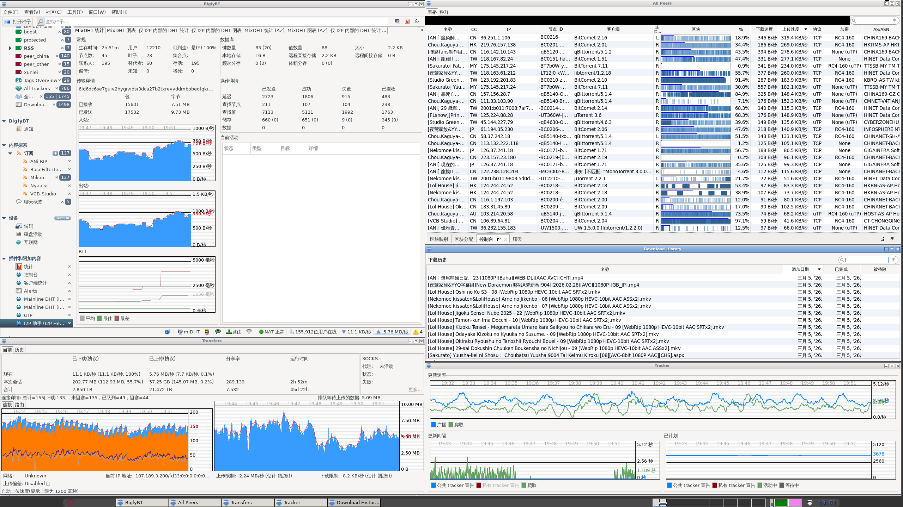

# SwarmAccelerator Project

PBH-BTN 种群加速计划。

## 介绍

种群加速计划是 PBH-BTN 运行的公益服务。通过利用 PBH-BTN 目前未完全使用的服务器资源加速新发布的 BitTorrent 资源下载，加快发种人出种速度、改善种群下载速度。  
该计划的本质是在服务器上运行一个或者多个 BT 下载器，通过 RSS 订阅并下载新发布的资源，并在服务器上保持做种一段时间后再进行删除。

该计划是 PBH-BTN 维护的公益项目，不对可靠性和稳定性做出保证。

## 覆盖范围

目前该计划覆盖以下 RSS 订阅源，注意我们可能会随时调整覆盖范围：

* ANi RIP
* Nyaa.si
* 蜜柑计划

注：为充分利用资源，任何带有 `DBD`, `搬运` 关键字的种子将被排除在过滤器外，对于多语言订阅源，只有 CHT、CHS 条目包含在覆盖范围内。  
此外任何 VCB-Studio 的种子也不在覆盖范围内，因为 VCB 自有分流组已能覆盖大部分传输流量。

## 移除策略

由于服务器资源有限，为保证其它关键服务运行，任务在满足下面的任意移除策略后就会从服务器上移除：

* 分享率达到 50.00
* 当存储空间使用达到上限时，为释放存储空间接受新发布种子
  * 超过总存储空间的新任务将被永久拒绝
  * 当删除除受保护的种子外的所有种子，仍然不足以释放足够存储空间的新任务将被永久拒绝
  * 任务距离添加不满 24 小时且同时分享率低于 1.5 的种子将被保护，不会因释放存储空间而被删除
 
## 速率限制策略

为保证服务稳定运行和充分利用带宽资源，我们执行以下速率限制策略：

* 除中国以外的其它国家和地区，速率限制 128k/s，即任何 CC 代码不为下列之一的国家/地区都将受到此速率限制：`CN, HK, MO, TW`
* 基于策略的滑动窗口限速：每 1 小时最多上传 200GB 数据；每 24 小时最多上传 1.7TB 数据

## 识别种群加速计划 Peer

种群加速计划的 Peer 只可能来自以下 IP 地址，**任何范围外的 IP 都不是我们的 Peer**。

```
107.189.3.200
2605:6400:30:faad:114:514:1919:810
```

为了方便识别，种群加速计划的 Client Name 将带有特别标记：

```
BiglyBT a.b.c.d (PBH-BTN Swarm Accelerator/x.y)
```

例如：

```
BiglyBT 4.0.0.0 (PBH-BTN Swarm Accelerator/1.0)
```

如果服务器不支持 BiglyBT，则有时也会使用 qBittorrent 的较新版本。

## 运行状态

自动更新。


