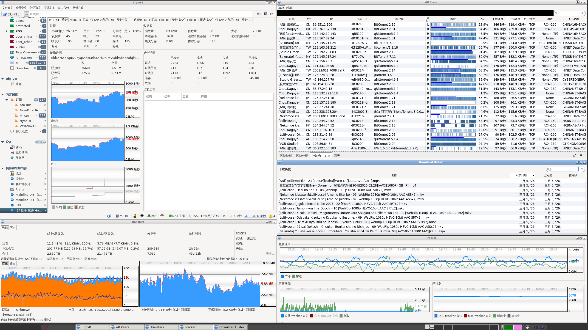

# SwarmAccelerator Project

PBH-BTN 种群加速计划。

## 介绍

种群加速计划是 PBH-BTN 运行的公益服务。通过利用 PBH-BTN 目前未完全使用的服务器资源加速新发布的 BitTorrent 资源下载，加快发种人出种速度、改善种群下载速度。  
该计划的本质是在服务器上运行一个或者多个 BT 下载器，通过 RSS 订阅并下载新发布的资源，并在服务器上保持做种一段时间后再进行删除。

该计划是 PBH-BTN 维护的公益项目，不对可靠性和稳定性做出保证。

## 覆盖范围

目前该计划覆盖以下 RSS 订阅源，注意我们可能会随时调整覆盖范围：

* ANi RIP
* Nyaa.si
* Mikan
* VCB-Studio

注：为充分利用资源，商业或主要为盈利为目的的字幕、压制、发布组不包含在加速范围内，任何带有 `DBD`, `搬运`, `Dynamis One` 关键字的种子也将被排除在过滤器外；此外对于主要为搬运资源的搬运组也会被排除在过滤器外。对于多语言订阅源，只有 CHT、CHS 条目包含在覆盖范围内。  


## 移除策略

由于服务器资源有限，为保证其它关键服务运行，任务在满足下面的任意移除策略后就会从服务器上移除：

* 分享率达到 50.00
* 当存储空间使用达到上限时，为释放存储空间接受新发布种子
  * 超过总存储空间的新任务将被永久拒绝
  * 当删除除受保护的种子外的所有种子，仍然不足以释放足够存储空间的新任务将被永久拒绝
  * 任务距离添加不满 8 小时的将强制保护；满 8 小时但不满 12 小时的将优先保留高分享率的任务；满 12 小时后，将优先保留低分享率的任务
 
## 队列机制

当我们认为一个种子满足广泛传播，无需加速，且无断种风险时，我们的系统*可能*会将其转入队列暂停任务，以便节约资源（带宽、CPU、内存等）。  
一旦不再满足条件且种子未被移除、系统会自动启动任务。

* 种子在所有 Tracker、及 DHT 网络上的节点数为 0 （即无人下载）
* 种源数超过 200
* 种源数超过 100 且每个种源对应的节点数量少于 2
* 种源数超过 100 且分享率大于 30.0
 
## 速率限制策略

为保证服务稳定运行和充分利用带宽资源，我们执行以下速率限制策略：

* 基于策略的滑动窗口限速：每 1 小时最多上传 300GB 数据；每 24 小时最多上传 1.3TB 数据
   * 未触及滑动窗口限速时，遵从以下限速策略：
      * 仅做种时：上传限速 40960KB/s
      * 有活动下载时：下载 20480KB/s，上传 31920KB/s。当下载与上传争抢带宽时，保留至少 20480KB/s 的带宽分配给做种任务
* 每个迅雷 Peer 固定分配最大 64kB/s 上传带宽，不分国家/地区
* 按照国家/地区分为 (1) peer_china (含大陆、台湾、香港、澳门) (2) peer_other (世界上的其它国家和地区)，共两个分组
  * 当上传/下载带宽未能达到限速峰值时，采取以下策略：
  * 下载时，优先从 peer_other 分组下载数据，peer_china 补足剩余可用下载带宽
  * 上传时，优先向 peer_china 分组上传数据，peer_other 补足剩余可用上传带宽

以下是正在使用的策略规则内容：

```
enable=yes

net_limit daily total=1.3TB
net_limit hourly total=300G

peer_set peer_china=CN;HK;TW;MO
peer_set peer_other=peer_china, inverse=yes
priority_up 1=peer_china, 2=peer_other, probe=5
priority_down 1=peer_other, 2=peer_china, probe=5
peer_set xunlei=all,client=(?i)(xunlei|7\..*|XL00.*), peer_up=64k

daily std_speed_limit from 00:00 to 23:59
```

## 连接池和上传槽位配置

根据实际情况由系统算法自动调整。

## 反吸血策略

加速计划使用 PeerBanHelper 默认策略（关闭反吸血\[迅雷\]和空闲连接拒绝攻击保护） + BTN 云端规则。

## 识别种群加速计划 Peer

种群加速计划的 Peer 只可能来自以下 IP 地址，**任何范围外的 IP 都不是我们的 Peer**。

```
107.189.3.200
2605:6400:30:faad:114:514:1919:810
```

为了方便识别，种群加速计划的 Client Name 将带有特别标记：

```
BiglyBT a.b.c.d (PBH-BTN Swarm Accelerator/x.y)
```

例如：

```
BiglyBT 4.0.0.0 (PBH-BTN Swarm Accelerator/1.0)
```

如果服务器不支持 BiglyBT，则有时也会使用 qBittorrent 的较新版本。

## 运行状态

[点此开始监工](https://swarmaccelerator-vnc.pbh-btn.com/)

下面的图片会定期更新↓


